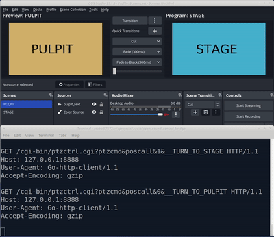

<h1>Table of contents</h1>


<!-- TOC -->
* [Open Sound Control Bridge](#open-sound-control-bridge)
  * [Example uses](#example-uses)
* [Install](#install)
* [Overview](#overview)
* [Configuration](#configuration)
  * [Example configuration](#example-configuration)
  * [Sources](#sources)
    * [Digital Mixing Consoles](#digital-mixing-consoles)
    * [Dummy console](#dummy-console)
    * [OBS bridges](#obs-bridges)
    * [HTTP bridges](#http-bridges)
    * [Tickers](#tickers)
<!-- TOC -->

# Open Sound Control Bridge

OSCBridge is a tool to help automate operations with audio/streaming gear.

Input could come from various sources, such as:

* Digital Audio Mixer Console state (such as Behringer X32 or other that supports OSC)
* OBS Studio state
* A HTTP Request
* Time

OSCBridge currently supports the following "tasks":

* HTTP Request
* Delay (just wait)
* OBS Change preview scene
* OBS Change program scene
* OBS Send "vendor" message to any plugin that cares, e.g. to the amazingly
  excellent [Advanced Scene Switcher](https://github.com/WarmUpTill/SceneSwitcher).
* Excecute a command
* Send an OSC message

## Example uses

Here is just a few idea:

* When a microphone is unmuted, turn the PTZ camera to the speaker.
* When the stage is unmuted, turn the PTZ camera to the stage.
* When a special HTTP request arrives, mute/unmute something.
* When a special HTTP request arrives, set the volume of a channel to the specified value.
* At a specified time, unmute a microphone.
* At a specified time, switch to an OBS Scene.
* At a specified time, send an HTTP Request.
* When something is unmuted, switch to a scene in OBS.
* When a scene is activated in OBS unmute certain channels.
* When a microphone is unmuted, then turn the camera but only if a ceratin OBS scene is active.
* When ... send a command to Advanced Scene Switcher, to do
  a [zillion other things](https://github.com/WarmUpTill/SceneSwitcher/wiki)
* When ... then make Advanced Scene Switcher do an http request to execute some other actions through the oscbridge. (
  Btw A.S.S. can send OSC messages too.)

I think now you got the point!

# Install

This section is under construction.

# Overview

From a birds eye view, oscbridge provides a central "message store", to which "osc sources" can publish messages.
Every time a new message arrives, each action is checked, if their trigger_chain conditions are resolving to true based
on the current store.
If every the trigger chain resolves to true, then the action's tasks are executed.

So this is the control flow:
[OSC SOURCES] -> [OSC MESSAGE STORE] -> [ACTION TRIGGER CHAIN] -> [ACTION TASK]

# Configuration

## Example configuration

Below is the simplest example to showcase how the system works.
<details>
<summary>Click to see YAML</summary>

```yaml
obs_connections:
  - name: "streaming_pc_obs"
    host: 192.168.1.75
    port: 4455
    password: "foobar"

osc_sources:
  console_bridges:
    - name: "behringer_x32"
      enabled: false
      prefix: ""
      host: 192.168.2.99
      port: 10023
      osc_implementation: l
      init_command:
        address: /xinfo
      check_address: /ch/01/mix/on
      check_pattern: "^0|1$"
      subscriptions:
        - osc_command:
            address: /subscribe
            arguments:
              - type: string
                value: /ch/01/mix/on
              - type: int32
                value: 10
          repeat_millis: 8000

  dummy_connections:
    - name: "behringer_x32_dummy"
      enabled: true
      prefix: ""
      iteration_speed_secs: 1
      message_groups:
        - name: mic_1_on
          osc_commands:
            - address: /ch/01/mix/on
              comment: "headset mute (0: muted, 1: unmuted)"
              arguments:
                - type: int32
                  value: 1
        - name: mic_1_off
          osc_commands:
            - address: /ch/01/mix/on
              comment: "headset mute (0: muted, 1: unmuted)"
              arguments:
                - type: int32
                  value: 0

actions:
  to_pulpit:
    trigger_chain:
      type: osc_match
      parameters:
        address: /ch/01/mix/on
        arguments:
          - index: 0
            type: "int32"
            value: "1"
    tasks:
      - type: http_request
        parameters:
          url: "http://127.0.0.1:8888/cgi-bin/ptzctrl.cgi?ptzcmd&poscall&0&__TURN_TO_PULPIT"
          method: "get"
          timeout_secs: 1
      - type: obs_scene_change
        parameters:
          scene: "PULPIT"
          scene_match_type: regexp
          target: "program"
          connection: "streaming_pc_obs"
      - type: obs_scene_change
        parameters:
          scene: "STAGE"
          scene_match_type: regexp
          target: "preview"
          connection: "streaming_pc_obs"

  to_stage:
    trigger_chain:
      type: osc_match
      parameters:
        address: /ch/01/mix/on
        arguments:
          - index: 0
            type: "int32"
            value: "0"
    tasks:
      - type: http_request
        parameters:
          url: "http://127.0.0.1:8888/cgi-bin/ptzctrl.cgi?ptzcmd&poscall&1&__TURN_TO_STAGE"
          method: "get"
          timeout_secs: 1
      - type: obs_scene_change
        parameters:
          scene: "STAGE"
          scene_match_type: regexp
          target: "program"
          connection: "streaming_pc_obs"
      - type: obs_scene_change
        parameters:
          scene: "PULPIT"
          scene_match_type: regexp
          target: "preview"
          connection: "streaming_pc_obs"
```

</details>

In this configuration there are two OSC sources:

* Dummy (enabled)
* A Behringer X32 digital console (disabled)

The dummy source acts as if someone would press Ch1's mute button every second to toggle it.

Then there are two actions defined, "to_pulpit" and "to_stage".
Each has a single trigger, that matches /ch/01/mix/on to be 0 or 1.

Then for each action, there are three tasks:

* An HTTP request that would recall a PTZ Optics camera preset (0 and 1 respectively).
* An obs_scene_change to change the program scene.
* An obs_scene_change to change the preview scene.

You can see the results on this gif:

<a href="docs/assets/readme/example_config.mkv"></a>

OBS is switching scenes based on the mute status, and at the bottom you can see the arriving requests.

You can just switch from the dummy to the console one, and your mute button is then tied to OBS scenes and the camera.

## Sources

### Digital Mixing Consoles

Many digital mixing consoles support a protocol
called "[Open Sound Control](https://en.wikipedia.org/wiki/Open_Sound_Control)",
this is a UDP based simple protocol. It is based on "Messages", where each message has an address, and 0 or more
arguments, and each argument can be a string, a float, an int, etc.

I have tested on Behringer X32, so most examples are based on this console.
See pmalliot's excellent work [here](https://sites.google.com/site/patrickmaillot/x32) on
X32's [OSC](https://drive.google.com/file/d/1Snbwx3m6us6L1qeP1_pD6s8hbJpIpD0a/view) implementation.

In the case of X32, we need to regularly(8-10 sec) issue a /subscribe command with proper arguments, to show that we are
interested in updates of a certain value from the console. Then the mixer is flooding us with the requested parameter.

So below is a real world example for behringer x32 OSC connection:

<details>
<summary>Click to see YAML</summary>

```yaml
osc_sources:
  console_bridges:
    # The name of this mixer
    - name: "behringer_x32"

      # If enabled, OSCBRIDGE will try to connect, and restart if fails.
      enabled: true

      # Prefix determines the message address prefix as it will be stored to the store.
      # E.g. if you'd have multiple consoles, you could prefix them "/console1", "/console2",
      # and you could match for /console1/ch/01/mix/on for example.
      prefix: ""

      host: 192.168.2.99
      port: 10023

      # The driver to use. We only have "l" for now.
      osc_implementation: l

      # This command is sent right after the connection is opened.
      # It can be used for authentication, or anything that is required.
      # X32 does not require anything, but for this it returns it's own name.
      init_command:
        address: /xinfo
        # You could specify arguments also.
        # arguments:
        #   - type: string
        #     value: "foobar"

      # There is a regular query running, for checking if the connection is still alive.
      # Specify an address here, and a regexp that matches the returned value.
      # If there is no response, or the response doesn't match, the connection is counted as broken and the app restarts.
      check_address: /ch/01/mix/on
      check_pattern: "^0|1$"
      # Subscriptions are commands that are sent regularly (repeat_millis) that cause the mixer to update us with the lates values for the subscribed thing.
      # Research your own mixer for the exact syntax, but this is how you do it for X32.
      subscriptions:
        - osc_command:
            # This command subscribes for channel 1's mute status. 0 is muted, 1 is unmuted.
            address: /subscribe
            arguments:
              - type: string
                value: /ch/01/mix/on
              - type: int32
                value: 10
          repeat_millis: 8000
```

</details>

### Dummy console

The dummy console implementation is just what it's name implies.
It has `message_groups`, and each `message_group` contains `messages`.
The dummy console iterates infinitely through the groups, and executes the messages in them.
Between each group it waits the configured ammount of time.

The below example configures two groups, called "mic_1_on" and "mic_1_off".

Therefore, it provides a way to test the logic even without a real connection to a mixer.
You can have a dummy emitting the same messages the real console would, and you can freely enable/disable any source,
so you can test, or you can switch to the real operation mode by enabling the console connection.

<details>
<summary>Click to see YAML</summary>

```yaml
osc_sources:
  dummy_connections:
    - name: "behringer_x32_dummy"
      # Use this source, or not.
      enabled: true

      # Prefix determines the message address prefix as it will be stored to the store.
      prefix: ""

      # How much delay should be between each group?
      iteration_speed_secs: 1

      # Message groups are set of messages being emitted at once.
      message_groups:
        - name: mic_1_on
          osc_commands:
            - address: /ch/01/mix/on
              comment: "headset mute (0: muted, 1: unmuted)"
              arguments:
                - type: int32
                  value: 1

        - name: mic_1_off
          osc_commands:
            - address: /ch/01/mix/on
              comment: "headset mute (0: muted, 1: unmuted)"
              arguments:
                - type: int32
                  value: 0

```

</details>

### OBS bridges

OSCBridge can be configured to connect to an OBS Studio instance via websocket, and it will subscribe to some events in
OBS.

These events are the following:

* CurrentPreviewSceneChanged
    * Message:
        * Address: /obs/preview_scene
        * Argument[0]: string, value: NAME_OF_SCENE
* CurrentProgramSceneChanged
    * Message:
        * Address: /obs/program_scene
        * Argument[0]: string, value: NAME_OF_SCENE
* RecordStateChanged
    * Message:
        * Address: /obs/recording
        * Argument[0]: int32, value: 0 or 1
* StreamStateChanged
    * Message:
        * Address: /obs/streaming
        * Argument[0]: int32, value: 0 or 1

In order to configure an OBS Bridge, you'll also need to configure an OBS Connection.

<details>
<summary>Click to see YAML</summary>

```yaml

obs_connections:
  - name: "streampc_obs"
    host: 192.168.1.75
    port: 4455
    password: "foobar12345"

osc_sources:
  obs_bridges:
    - name: "obsbridge1"
      # You may choose to disable it.
      enabled: true

      # Prefix determines the message address prefix as it will be stored to the store.
      prefix: ""

      # The name of the obs connection, see above.
      connection: "streampc_obs"

```

</details>

### HTTP bridges

HTTP Bridges in OSCBridge enables you to open a port on a network interface and start a HTTP server on them.
The server can receive special HTTP GET requests, and converts them to OSC messages and stores them in the message
store.
Then you can write actions that check for that value, and may even execute tasks based on it.

The message can be put away under some namespace by using the prefix option, but you could also use it to override an
existing message.

To insert an OSC Message like this:

```
Message(address: /foo/bar/baz, arguments: [Argument(string:hello), Argument(int32:1)])
```

Execute a GET request like this:

```bash
curl "127.0.0.1:7878/?address=/foo/bar/baz&args[]=string,hello&args[]=int32,1"
```

<details>
<summary>Click to see YAML</summary>

```yaml
osc_sources:
  http_bridges:
    - name: "httpbridge1"
      # You may choose to disable it.
      enabled: true
      # Prefix determines the message address prefix as it will be stored to the store.
      prefix: ""
      port: 7878
      host: 0.0.0.0
```

</details>

### Tickers

You can enable "Tickers", that would regularly update the store with messages representing the current date/time.

The ticker publishes several packages under "/time/" (if you don't specify a prefix), with names that might be weird for
the first time,
if you are not familiar with how golang's time formatting works.

You may see the full reference [here](https://cs.opensource.google/go/go/+/refs/tags/go1.21.3:src/time/format.go;l=9).

Currently these messages are being emitted in every iteration:

* /time/2006
* /time/06
* /time/Jan
* /time/January
* /time/01
* /time/1
* /time/Mon
* /time/Monday
* /time/2
* /time/_2
* /time/02
* /time/__2
* /time/002
* /time/15
* /time/3
* /time/03
* /time/4
* /time/04
* /time/5
* /time/05
* /time/PM

So if you want to match for hour:minute, then you want to match the values of /time/15 and /time/04 respectively in the
trigger chain (to be explained later).

<details>
<summary>Click to see YAML</summary>

```yaml
osc_sources:
  tickers:
    - name: "ticker1"
      # You may choose to disable it.
      enabled: true

      # Prefix determines the message address prefix as it will be stored to the store.
      prefix: ""

      # How often updates should occur
      refresh_rate_millis: 1000
```

</details>


The documentation will be continued.
